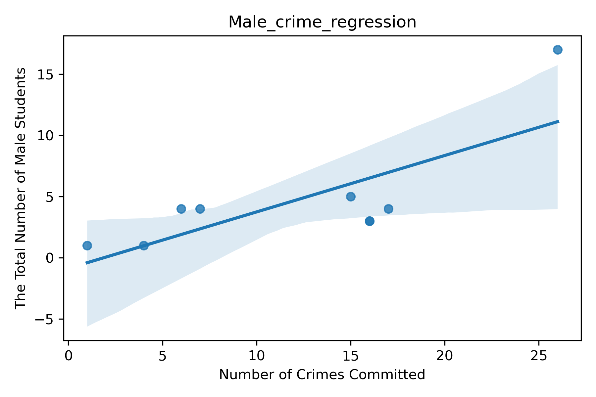

# [Upward Bound Program: Male vs Female Retention](https://github.com/DKBowenx7/Upward_Bound.git)

## **What is the Upward Bound Program & Why is there a Focus on Male vs Female Retention?**

***

### _What is the Upward Bound Program_: 
Upward Bound is part of the overarching TRIO Program in the United States, which is federal and state grant-funded. The program caters to the educational enrichment and attainment of historically disenfranchised and low-income high school students to help them graduate from high school successfully and enter college.
 

### _The Purpose of the Repository_
This repository is looking at the female versus male retention rate in the Upward Bound program in Syracuse, New York, and seeing if there is a relationship to crime in Onondaga County in Syracuse, New York. As it is becoming more pronounced domestically and globally, there is an increase in young males not joining or remaining in educational programs and/or institutions. This is now a growing concern since when some males drop out, they are targets to gang recruitment and loss of high-quality wages due to a lack of a high school diploma/GED or tertiary level degree.

Therefore, to bring the Upward Bound Program into focus alongside its students' retention rates, the repository was built with the inclusion of data files from the Syracuse Open Data portal to gather Onondaga county shapefiles and crime statistics; the Census Data to retrieve the area's zip codes; and information of the student's participation activity kindly given to me by the program.

#### _Where to get the data used_
- [Syracuse Open Data Portal](https://data.syr.gov/)
Here you can locate and download most Syracuse City Data if available.
- Contacting [The Le Moyne College Upward Bound Program](https://www.lemoyne.edu/Academics/Programs-for-High-School-Students/Upward-Bound1#:~:text=The%20Upward%20Bound%20Program%20has,school%20graduation%20to%20college%20enrollment.)
- [Census.gov:Zip Code Tabulation Areas (ZCTAs)](https://www.census.gov/geographies/mapping-files/time-series/geo/cartographic-boundary.2020.html#list-tab-1883739534)

***

## **Scripts Main Inputs & Outputs**

### 1st script: UB_data.py

_What does this script do?_
    This script reads the Upward Bound student participation file to see how many students are:
- 1.currently in the program
- 2.left the program
- 3.currently in college (once they have completed high      school)
- 4.how many females and males are participating
- 5.how many students per home zip codes
     ..*

_Input_:"UB_data.csv"

_Output_:
Script name: UB_data.py
Variables: 
- Students_Per_Zip_Code.png
- Male_vs_Female_Status.png

***
### 2nd script: Cohort_Participation1.py
_What does this script do?_
This script reads the first script to break down the aggregated data presented in the UB_info file. The script shows the ratio of male to females in the program by illustrating it in pie charts.

_Input_:"UB_data.xlsx"

_Output_:
Script name: Cohort_Participation1.py
Variables: 
- "project.csv"
- female_P2015 (this included others from P2015-P2020)
- female_P2015_percentage (this included others from P2015-P2020)
- male_P2015 (this included others from P2015-P2020)
- male_P2015_percentage (this included others from P2015-P2020)
- Kindly images in the repository that features 'Gender vs Year' in the title.

***
### 3rd script: Cohort_Participation.py

_What does this script do?_
This script reads the second script to visualize the participation differences between the cohorts. The goal of this is to see which cohort has the most to least male and female retention rates. 

_Input_:"UB_data.xlsx", "project.csv"

_Output_:
Script name: Cohort_Participation1.py

Variables: 
- Cohort1_4years_of_highschool.png
- Cohort2_throughout_highschool.png
- Cohort3_throughout_highschool.png
- Cohort4_throughout_highschool.png
- Cohort5_throughout_highschool.png
- Cohort6_throughout_highschool.png
- Cohort7_throughout_highschool.png

***
### 4th script: Zipcode.py
_What does this script do?_
This script collects the zip codes needed to do the comparison of crime and male participation. The other file, comes from the Syracuse Open Data Portal to get the geographical dimensions to create the map on QGIS. 

_Input_:"cb_2020_us_zcta520_500k.zip", "Census_Block_Groups_in_Syracuse%2C_NY_(2010).zip"

_Output_:
Script name: Zipcode.py

Variables: 
- border: to get the geographical boundaries in Syracuse.
- county: to get specifically Onondaga County
- syr_zips: to only show zipcodes in Syracuse.
- utm18n = to make the border lines more defined.

***
### 5th script: Male_zipcodes.py
_What does this script do?_
The fifth script predominately look at the male participation in the program to be used for the next script for the crime comparison. The results will be used to map onto the Onondaga map. 

_Input_:"project.csv", "UB_data.xlsx"

_Output_:
Script name: Male_zipcodes.py, "Student_zips.gpkg"
### 6th script: Crime_Male.py
_What does this script do?_
This script does the comparison of the number of males in the program and the number of crime committed in Syracuse by demonstrating it in a regression and scatterplot. 

_Input_:"project.csv", "UB_data.xlsx"

_Output_:
Script name: "Male_Participation_vs_Crime_Rates.png, "Male_crime_regression.png"

***

# **Main Findings & Analysis**

### _Results from UB_data.py_

_This graph shows the participation number and status of the sexes in the Upward Bound Program. It shows that there are significantly more females compared to male, who are and were active in the program._

- X axis: Students Status.
- Y axis: Number of Male vs Female Students in the Program.

_As seen in the bar chart, most of the students,especially male students in the program lives in the zip code 13208._

-X axis: Students' Home Zip Codes
- Y axis: Number of Males vs Females

***

### _Zipcode.py_

_Description:_ The map illustrates a display of male to female ratio in a pie chart, and multiple coloured dots that represents different crimes committed in 2018. Also, the block group colours symbolizes the number of students per zip code. So, red means there is 0 students in that zip code and the dark green shows that most students are from that area. 

- Analysis: As discussed before, most students reside in 13208, which is also known as the Northside. For a small subsection, there is a clustered pattern of committed crime in that area. However that does not mean there is a causal relationship between the number of crimes and male participation in the program. 

***

### _Crime_Male.py_

_Scatter Plot_

_Regression Visualization_

- X axis: Number of crimes committed
- Y axis: The Total Number of Male Students

_Analysis of graphs_
- The shaded area represents the confidence interval of the regression graph.

The graphs suggest a positive correlation between the number of crimes committed and the total number of male students in the program. However, it is statistically insignificant at the 95 confidence level. There are limitations to this interpretation. Therefore, I cannot say that there is a direct causal relationship. 

***
In the repository, please look at the other images!

